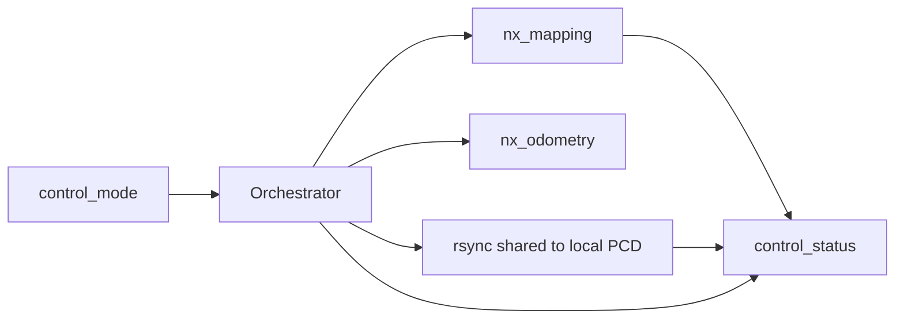

# LIGO MQTT 통합 가이드

MQTT 브로커 설정, 토픽 이름, 페이로드, 모드 오케스트레이션을 한 문서로 정리한다. **토픽 접두사·브로커 주소·동기화 경로는 [`config/mqtt_topics.yaml`](../config/mqtt_topics.yaml)에서 단일 관리**한다.

## 설정 파일

| 항목 | 설명 |
|------|------|
| [`config/mqtt_topics.yaml`](../config/mqtt_topics.yaml) | `mqtt.*` (host, port, topic_prefix, topics 템플릿), `sync.*` (shared_map_root, local_map_root, rsync_options), `orchestrator.*` (stop/start 타임아웃) |
| 환경 변수 `LIGO_MQTT_CONFIG` | 사용할 YAML 절대 경로 (최우선) |
| 환경 변수 `LIGO_ROOT` | `sync.local_map_root`의 `${LIGO_ROOT}` 치환 (미설정 시 패키지 루트로 추정) |

### `orchestrator.*`

| 키 | 기본값 | 의미 |
|----|--------|------|
| `stop_timeout_sec_mapping` | `86400.0` | mapping `stop` 시 SIGINT → SIGTERM 까지 대기(초). 매핑은 종료 직전 PCD/그리드 저장이 오래 걸리므로 [`launch/nx_mapping.launch.py`](../launch/nx_mapping.launch.py) 의 `sigterm_timeout` 기본값과 맞춰 24h. |
| `stop_timeout_sec_odometry` | `10.0` | odometry `stop` 시 SIGINT → SIGTERM 까지 대기(초). |
| `start_confirm_sec` | `1.5` | 런치 직후 즉시 사망 여부 확인 시간(초). |

오케스트레이터는 `ros2 launch` 를 **새 process group의 leader**로 띄우고(stop 시 `os.killpg` 로 PG 전체에 SIGINT/SIGTERM/SIGKILL 전파), 터미널 Ctrl+C 와 동일하게 `ligo_mapping`·`ligo_topic_to_mqtt` 등 모든 자식 노드가 즉시 시그널을 받는다. 이렇게 하지 않으면 launch 가 자식 propagation 을 빠뜨리는 케이스에 매핑 저장이 시작되지 않을 수 있다.

원격 `stop` 명령 처리는 **별도 워커 스레드**에서 진행한다. mapping 의 PCD/그리드 저장이 수 분~수십 분 걸려도 MQTT 콜백 스레드가 막히지 않으므로 keepalive 가 끊기지 않고, 매핑이 끝나면 워커가 `event="stop"` → (성공 시) `event="map_saved"` 순으로 발행한다.

상태 메시지는 **재연결 시 손실 방지용 링 버퍼**(최대 200개)에 저장한다. MQTT 연결이 끊긴 동안에 `_publish_status` 가 호출되면(예: 매핑 저장 중 브로커/프록시 측 단절) 큐에 넣어 두고, 재연결 후 `_on_connect` 에서 순서대로 flush 한다. 따라서 long mapping → 끊김 → 재연결 시나리오에서도 `event="stop"`·`event="map_saved"` 가 viewer 에 도달한다.

설치 후 경로: `share/ligo/config/mqtt_topics.yaml` (`ament_index`로 탐색).

### `mqtt.topics` 템플릿

`{prefix}`는 `mqtt.topic_prefix` 값으로 치환된다.

| 키 | 기본 템플릿 |
|----|-------------|
| `control_mode` | `{prefix}/control/mode` |
| `control_status` | `{prefix}/control/mode_status` |
| `position` | `{prefix}/position` |
| `heading` | `{prefix}/heading` |
| `gps` | `{prefix}/gps` |
| `init_heading_icp` | `{prefix}/init_heading_icp` |
| `ligo_mode` | `{prefix}/ligo_mode` |
| `nav_prefix` | `{prefix}/nav` |

---

## 실행 구성 요소

| 스크립트 | 역할 |
|----------|------|
| `scripts/ligo_topic_to_mqtt.py` | ROS → MQTT 브리지 |
| `scripts/mqtt_mode_orchestrator.py` | MQTT 제어 → mapping / odometry 런치, 맵 동기화 |
| `scripts/mqtt_nav_pub.py` | 내비 테스트용 1회 발행 |

공통 로더: `scripts/mqtt_config.py` (`load_mqtt_config`, `resolve_topic`, `topic_prefix`, …).

---

## ROS → MQTT 브리지 (`ligo_topic_to_mqtt.py`)

### 동작

- **이벤트 기반** 발행 (고정 주기 아님).
- **QoS 0**, **retain false**, UTF-8 JSON (`ensure_ascii=False`).
- 기본 **WebSocket** (`mqtt.use_websocket`, `mqtt.ws_path`).
- ROS 파라미터 **기본값**은 `config/mqtt_topics.yaml`의 `mqtt` 블록과 동기화된다. 런타임에 `-p mqtt.topic_prefix:=...` 등으로 덮어쓸 수 있다.
- 재연결 직후 캐시 상태를 주요 토픽에 1회 재발행한다.

### ROS 파라미터 (브리지)

| 파라미터 | 설명 |
|----------|------|
| `mqtt.host`, `mqtt.port` | 브로커 |
| `mqtt.topic_prefix` | 접두사 (yaml 기본) |
| `mqtt.use_websocket`, `mqtt.ws_path` | 전송 방식 |
| `mqtt.username`, `mqtt.password` | 선택 |
| `mqtt.keepalive_sec` | 정수 초 |
| `reconnect_period_sec` | 재연결 시도 주기 |

### 구독 ROS 토픽 파라미터

| 파라미터 | 기본값 |
|----------|--------|
| `topic.global_position` | `/ligo/global_position` |
| `topic.odom` | `/aft_mapped_to_init` |
| `topic.receiver_pvt` | `/ublox_driver/receiver_pvt` |
| `topic.heading_align_status` | `/ligo/nmea_heading_align_status` |
| `topic.ligo_mode` | `/ligo/mode` |

### 토픽별 JSON (공통: `timestamp_unix`)

**`{prefix}/position`** — `lat`, `lon` (구독 ROS 토픽 `topic.global_position`(기본 `/ligo/global_position`) 수신마다 발행)

**`{prefix}/heading`** — `deg_from_north_cw`, `cardinal` (ICP LOCK 이후)

**`{prefix}/gps`** — `status` (`신호없음` / `신호미약` / `신호정상`), `ntrip_connected`

**`{prefix}/init_heading_icp`** — `success`, `status` (`UNALIGNED` / `COLLECTING` / `LOCKED`)

**`{prefix}/ligo_mode`** — `/ligo/mode` JSON 축약 (실내 시 `pcd_name` 등)

---

## 모드 오케스트레이터 (`mqtt_mode_orchestrator.py`)

### 토픽

- **제어 (구독)**: `mqtt.topics.control_mode` → 기본 `{prefix}/control/mode`
- **상태 (발행)**: `mqtt.topics.control_status` → 기본 `{prefix}/control/mode_status`

### 제어 입력 JSON

#### Mapping 시작

`map_name`, `sub_map_name` 필수. 허용 문자: 영문·숫자·`_`·`-`.

```json
{
  "command": "start",
  "mapping_mode": true,
  "map_name": "site_a",
  "sub_map_name": "floor_1"
}
```

#### Odometry 시작

`PCD/<map_name>/` 하위 sub-map 전체 로드 (설정의 `map_folder` 기준, 개발 시 `config/avia.yaml`의 `map_folder` 참고).

```json
{
  "command": "start",
  "mapping_mode": false,
  "map_name": "building_a"
}
```

#### 맵 동기화 (공유 → 로컬 `PCD`)

`rsync`로 `sync.shared_map_root/<map_name>/` → `sync.local_map_root/<map_name>/`. **mapping·동기화가 이미 돌아가면 `stop`을 제외한 명령은 거부**한다.

```json
{
  "command": "synchronization",
  "map_name": "site_a"
}
```

#### 종료

```json
{ "command": "stop" }
```

### 단일 작업 정책 (running 중 거부)

오케스트레이터는 동시에 **하나의 작업**만 수행한다. mapping·odometry 실행 중이거나 동기화(`sync`)가 진행 중이면, **`stop`을 제외한 모든 명령**(`start`(mapping/odometry), `synchronization`)은 즉시 거부되고 다음 형태의 에러가 발행된다.

- `event`: 거부 대상에 따라 `start` 또는 `sync`
- `status`: `error`
- `message`: 현재 진행 중인 작업 종류 명시 + `{"command":"stop"}`을 먼저 보내라는 안내
- `extra.running`: `{"running": "mapping"|"odometry"|"sync", "pid": <int>, "map_name": "...", ...}`
- `extra.rejected_command`: 거부된 명령 종류

새 작업을 시작하려면 항상 `{"command":"stop"}`으로 현재 작업을 종료한 뒤 다시 보내야 한다. 동기화는 자체 종료를 기다려야 한다(`stop`이 sync 스레드를 강제 종료하지는 않음).

### 상태 출력 (`mode_status`)

공통 필드: `timestamp_unix`, `event`, `status`, `message`, `mode`, `map_name` (및 매핑 시 `sub_map_name`). `extra`에 부가 정보.

| `event` | 의미 |
|---------|------|
| `ready` | 구독 완료, 제어 대기 |
| `start` | 런치 시작 |
| `stop` | stop 또는 서비스 종료로 프로세스 종료 시도 완료 |
| `ended` | 하위 launch 프로세스 종료 (`exit_code`) |
| `control` | 잘못된 제어 JSON (`status=error`) |
| `sync` | 동기화 시작 (`status=ok`, message만) / 완료 (`status=ok`, `extra.elapsed_sec`) / 실패 (`status=error`, `extra.reason`, `extra.elapsed_sec`) |
| `map_saved` | mapping 정상 종료(원격 `stop` 또는 자체 종료) 후 공유 경로에서 PCD·그리드 산출물 검증 결과 (`extra.save_root`, `extra.files`, `extra.missing`) |

`map_saved`는 기대 파일 4종 존재 여부를 검사한다: `<sub>.pcd`, `<sub>_ecef.pcd`, `<sub>_grid2d.pgm`, `<sub>_grid2d.yaml` (경로: `sync.shared_map_root/<map_name>/<sub_map_name>/`). NMEA/ENU 저장 조건에 따라 일부가 없을 수 있으면 `status=warn` 및 `missing` 배열로 알린다.

### 상태 페이로드 예시 (정상 흐름)

오케스트레이터 기동부터 mapping → 종료까지 시간순으로 발행되는 `mode_status` 메시지 예시. `timestamp_unix` 는 가독성을 위해 짧게 표기.

#### 1) 오케스트레이터 기동 직후 — `event="ready"`

```json
{
  "timestamp_unix": 1778477000.000,
  "event": "ready",
  "status": "ok",
  "message": "모드 제어 대기 중입니다.",
  "mode": "idle",
  "map_name": ""
}
```

#### 2) Mapping 시작 — `event="start"`

`extra.pid`는 `ros2 launch` 프로세스, `extra.command`는 실제 실행된 커맨드.

```json
{
  "timestamp_unix": 1778477010.000,
  "event": "start",
  "status": "ok",
  "message": "mapping 모드 실행을 시작했습니다.",
  "mode": "mapping",
  "map_name": "site_a",
  "sub_map_name": "floor_2",
  "pid": 35710,
  "command": "ros2 launch ligo nx_mapping.launch.py map_name:=site_a sub_map_name:=floor_2"
}
```

#### 3) `stop` 명령 처리 후 매핑 정상 종료 — `event="stop"`

`exit_code: 0` 이면 PCD/그리드 저장까지 완료되고 launch 가 정상 종료된 상태.

```json
{
  "timestamp_unix": 1778477750.000,
  "event": "stop",
  "status": "ok",
  "message": "모드를 정상 종료했습니다.",
  "mode": "mapping",
  "map_name": "site_a",
  "sub_map_name": "floor_2",
  "exit_code": 0,
  "reason": "remote_stop_message"
}
```

#### 4) 매핑 산출물 검증 — `event="map_saved"`

`event="stop"` 직후 워커가 `sync.shared_map_root/<map>/<sub>/` 의 4종 파일을 확인하고 발행한다. 모두 존재하면 `status="ok"`:

```json
{
  "timestamp_unix": 1778477750.100,
  "event": "map_saved",
  "status": "ok",
  "message": "맵·서브맵 산출물이 모두 저장되었습니다.",
  "mode": "mapping",
  "map_name": "site_a",
  "sub_map_name": "floor_2",
  "save_root": "/mnt/rms_maps/site_a/floor_2",
  "files": [
    {"name": "floor_2.pcd", "size": 5516827},
    {"name": "floor_2_ecef.pcd", "size": 5516827},
    {"name": "floor_2_grid2d.pgm", "size": 130847},
    {"name": "floor_2_grid2d.yaml", "size": 964}
  ],
  "missing": []
}
```

일부 산출물(예: ENU 미정합으로 `_ecef.pcd`·grid2d 생략)이 없으면 `status="warn"` + `missing`:

```json
{
  "timestamp_unix": 1778477750.100,
  "event": "map_saved",
  "status": "warn",
  "message": "일부 산출물이 없습니다: floor_2_ecef.pcd, floor_2_grid2d.pgm, floor_2_grid2d.yaml",
  "mode": "mapping",
  "map_name": "site_a",
  "sub_map_name": "floor_2",
  "save_root": "/mnt/rms_maps/site_a/floor_2",
  "files": [{"name": "floor_2.pcd", "size": 5516827}],
  "missing": ["floor_2_ecef.pcd", "floor_2_grid2d.pgm", "floor_2_grid2d.yaml"]
}
```

#### 5) Odometry `stop` — `event="stop"`

```json
{
  "timestamp_unix": 1778478000.000,
  "event": "stop",
  "status": "ok",
  "message": "모드를 정상 종료했습니다.",
  "mode": "odometry",
  "map_name": "site_a",
  "exit_code": 0,
  "reason": "remote_stop_message",
  "indoor_map_names": ["site_a"]
}
```

#### 6) 맵 동기화 — `event="sync"` 시작 → 완료

시작:

```json
{
  "timestamp_unix": 1778477020.000,
  "event": "sync",
  "status": "ok",
  "message": "맵 동기화를 시작했습니다.",
  "mode": "idle",
  "map_name": "site_a"
}
```

완료:

```json
{
  "timestamp_unix": 1778477032.350,
  "event": "sync",
  "status": "ok",
  "message": "맵 동기화가 완료되었습니다.",
  "mode": "idle",
  "map_name": "site_a",
  "elapsed_sec": 12.345
}
```

실패(공유 경로 부재, rsync 비정상 종료 등):

```json
{
  "timestamp_unix": 1778477021.500,
  "event": "sync",
  "status": "error",
  "message": "맵 동기화에 실패했습니다.",
  "mode": "idle",
  "map_name": "site_a",
  "reason": "rsync exit=23: rsync: link_stat \"/mnt/rms_maps/site_a\" failed: No such file or directory",
  "elapsed_sec": 0.123
}
```

#### 7) 프로세스 자체 종료(원격 stop 없이 launch 가 끝났을 때) — `event="ended"`

```json
{
  "timestamp_unix": 1778478500.000,
  "event": "ended",
  "status": "ok",
  "message": "모드 실행이 종료되었습니다.",
  "mode": "mapping",
  "map_name": "site_a",
  "sub_map_name": "floor_2",
  "exit_code": 0
}
```

#### 8) 잘못된 제어 JSON — `event="control"`

```json
{
  "timestamp_unix": 1778477005.000,
  "event": "control",
  "status": "error",
  "message": "mapping_mode=true일 때 sub_map_name은 영문/숫자/_/- 조합의 필수 문자열입니다.",
  "mode": "idle",
  "map_name": ""
}
```

### 실행 런치

- Mapping: `ros2 launch ligo nx_mapping.launch.py map_name:=… sub_map_name:=…`
- Odometry: `ros2 launch ligo nx_odometry.launch.py indoor_map_name:=…`

---

## 테스트 유틸 (`mqtt_nav_pub.py`)

기본 `--host` / `--port` / `--topic-prefix`는 `mqtt_topics.yaml`에서 읽는다. 내비 토픽: `{nav_prefix}/{kind}` (기본 `{prefix}/nav/goal` 등).

---

## 운영 시나리오 (요약)



systemd 설치·검증 절차는 [`systemd_mode_orchestrator_commands.md`](systemd_mode_orchestrator_commands.md)를 따른다.

---

## 실행 예

```bash
python3 scripts/ligo_topic_to_mqtt.py --ros-args \
  -p mqtt.host:=127.0.0.1 \
  -p mqtt.port:=1883 \
  -p mqtt.use_websocket:=false \
  -p mqtt.topic_prefix:=navi1
```

의존성: `paho-mqtt`, `PyYAML` (`python3-yaml`).
